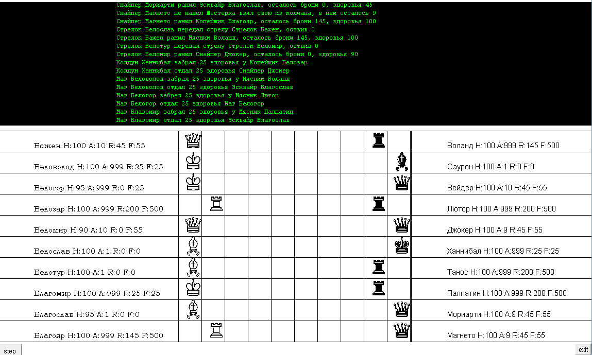

## Задание

Прикрутить view

## Плач Ярославны

Ну очень, расстроило отсутствие в IDEA команды очистки
экрана. В предыдущих версиях этой игры использовал, с этой функцией, красивое
меню, раскрашивал символы (слова) в терминале, как на винде так и линухе, но все померкло когда увидел длинный рыцарский свиток, всех как бы вложенных меню, в окне вывода IDEA. Как же тогда тут делать консольные утилиты или графические оболочки для терминала?!?

Ок, Ява не для терминала, не какой-то там скриптовый bash или python.

## Решение

[Переделал игру кардинально](https://github.com/allseenn/oop/tree/main/game). Задача прикрутить View, выполнена с помощью библиотеки java.awt.

На выходе получаем полностью графическую оболочку. Немного неказисто, может не удобный UI.

Но, это моя первая программа (игра) с ООП, да еще с
графикой.

С помощью класса Frame созданы 5 фреймов:

1. Верхний (Северный) постарался сделать в стиле юниксовой консоли, тут отображаются события и действия совершаемые юнитами.
2. Средный (Центральный) – игральное поле. Напоминает шахматную доску. Использовал юникод шрифты с фигурками. Черные играют за зло. Белые за добро )
3. Левый (Западный) фрейм – Список игроков белой команды с их ТТХ.
4. Правый (Восточный) фронт )) – Список игроков черной команды с их ТТХ
5. Нижний (Южный) – это узкая полоска – панель кнопок. Где левая кнопка step и правая exit.

При нажатии на кнопку step активируется запуск цикла, осуществляющего поочередное исполнение каждым юнитом, в соответствии с его приоритетом набора его уникальных действи.

Все эти действия, вернее большая их часть отображается в верхнем терминале.

В боковых панелях в соответствии с повреждениями, либо лечением, меняются ТТХ: здоровье, броня, боезапас.

Победой в игре считается, когда команда осталась одна. Об этом сообщается в терминале, и кнопка stepстановится неактивной.

В любой момент можно воспользоваться кнопкой exit, для выхода из программы (игры).

Чтобы игра была более-менее завершенной. Дописал метод step() для пехоты, в моем случае Мясник и Копейщик. Скорее всего их алгоритм действий не совершенен и содержит, какие-либо баги. Но, они двигаются и уничтожают всех противников на соседней клетке, если дойдут. Для большего интереса я им поднял броню и здоровье в два раза. А также увеличил силу удара до 500, что позволит им убивать с одного удара даже себе подобного пехотинца.

Алгоритм поиска врага использовал, тот же что и у Лучников и Магов. Вот с движением пришлось повозиться и пока сделал как у ладьи в шахматах, недаром Копьеносцы имеют фигурку Туры.

Расчеты следующие. Первым делом узнаем айди ближайшего врага, далее для  4 направлений, (в будущем можно сделать для 8 направлений): на клетку выше и ниже, на клетку вправо и влево. Высчитываем дистанцию до нашего ближайшего врага. Итого мы имеем 4 дистанции. Среди этих 4 дистанций находим минимальную. Следовательно, на следующем этапе перемещаем Копейщика в эту координату. На следующем этапе проверяем, есть ли в соседней клетке враг, если таковой есть, то включаем метод damage и по его алгоритму наносим урон противнику, и получаем бонусы в виде брони, если врага поразили.

## Пожелания

Т.к. к написанию приложения с графической основой я приступил раньше чем, завтрашний семинар, то надеюсь на снисходительность к моим возможным огрехам в программировании. Постараюсь все причесать после получения опыта на Ваших занятиях.
